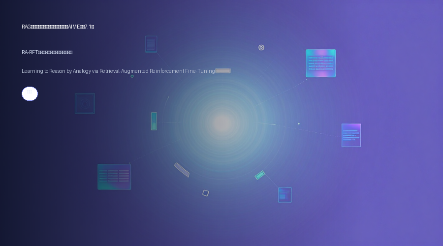

# RAG推理新范式：类比学习+强化微调，AIME提升7.1分
### RA-RFT：让模型学会“找相似例题”来推理

> 传统RAG检索只找语义相似的文本，但数学推理题需要的是解题思路的相似。这篇论文提出RA-RFT，通过“黄金相关性蒸馏”训练检索器，再用强化微调让模型学会类比推理，在AIME 2025上比GRPO提升7.1个点。
**论文**：Learning to Reason by Analogy via Retrieval-Augmented Reinforcement Fine-Tuning
**作者**：Zilin Xiao, Qi Ma, Chun-cheng Jason Chen, Xintao Chen, Avinash Atreya 等
**来源**：[arXiv:2606.13680](https://arxiv.org/abs/2606.13680)

---
## 为什么需要“推理感知”的检索？
现有的RAG系统大多依赖词法或语义相似度来检索文档，这在问答、摘要等任务上表现不错。

但到了复杂推理场景，问题就来了：两个数学题表面相似（比如都考“概率”），解题路径可能完全不同；而一个看似无关的问题，反而可能共享相同的推理结构。

简单来说，**语义相似 ≠ 推理相似**。作者认为，检索应该服务于推理，而不是文本匹配。
## 核心方法：RA-RFT如何工作？
RA-RFT是一个两阶段的后训练框架：

1. **黄金相关性蒸馏**：先用一个强大的推理模型（如DeepSeek-R1）对每个问题生成多个推理轨迹，然后根据这些轨迹是否导致正确答案，来标注哪些检索到的样例是“有用的”。训练一个检索器，让它学会按**推理收益**排序，而非语义重叠。

2. **强化微调**：在推理时，检索器为每个问题返回若干类比样例（包括问题+完整推理过程）。然后使用强化微调方法（如GRPO）来训练策略模型，让它学会从这些示范中提取推理模式，并在可验证的奖励信号下优化。

值得注意的是，RA-RFT检索到的样例往往提供**互补的解题思路**，而不是重复信息，这为模型提供了多样化的推理脚手架。
## 实验结果有多强？
在多个高难度数学推理基准上，RA-RFT一致优于标准强化微调方法。

以AIME 2025为例（32次采样平均准确率）：
- **Qwen3-1.7B**：RA-RFT比GRPO提升 **7.1个点**
- **Qwen3-4B**：提升 **2.8个点**

在MATH-500和AMC 2023上也有类似幅度的提升。

作者还分析了检索样例的多样性，发现推理感知的检索能挖掘出不同解题策略，这对模型泛化能力至关重要。
## 划重点
- **核心洞察**：语义检索不适合推理任务，需要按“推理相关性”来检索
- **方法亮点**：黄金相关性蒸馏 + 强化微调，两者结合让模型学会类比推理
- **性能提升**：在AIME 2025上最高提升7.1个点，且与奖励设计、训练课程等改进正交
- **实用价值**：RA-RFT可以作为一个通用后训练框架，适用于任何需要推理的RAG场景
## 写在最后
RA-RFT告诉我们，RAG在推理任务上的潜力远未被挖掘。当检索不再只是“找相似文本”，而是“找相似解法”，模型才能真正学会举一反三。

论文已公开在arXiv，代码和模型即将开源。感兴趣的同学可以去看看原文，尤其是附录中对检索多样性分析的实验，很有意思。
---
📄 **阅读原文**：[PDF 下载](https://arxiv.org/pdf/2606.13680) | [arXiv 页面](https://arxiv.org/abs/2606.13680)

