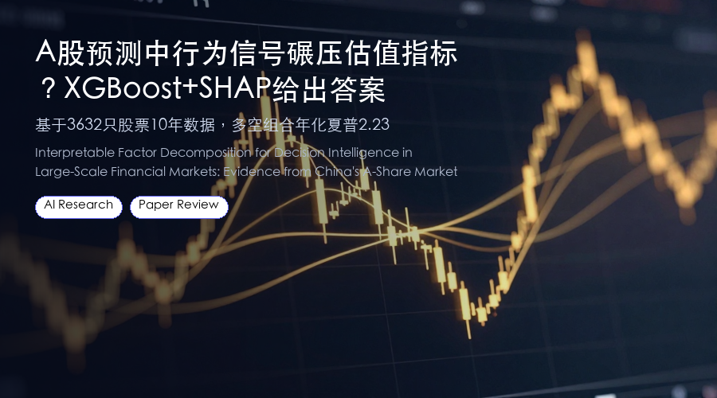
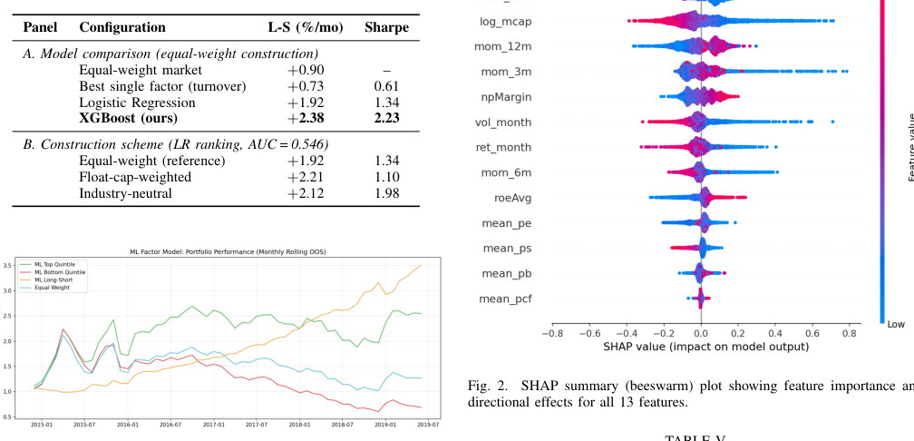

# A股预测中行为信号碾压估值指标？XGBoost+SHAP给出答案
### 基于3632只股票10年数据，多空组合年化夏普2.23

> 在A股这个散户主导的市场，哪些指标真正能预测收益？估值指标还是交易行为？一篇来自埃默里大学、佐治亚理工、宾大和纽大的研究，用XGBoost+TreeSHAP对3632只股票做了10年回测，发现行为信号贡献了58.2%的预测力，估值指标仅占10.7%。
**论文**：Interpretable Factor Decomposition for Decision Intelligence in Large-Scale Financial Markets: Evidence from China's A-Share Market
**作者**：Xiao Han, Yao Xiao, Zhen Zhang, Moxuan Zheng
**来源**：[arXiv:2606.12843](https://arxiv.org/abs/2606.12843)

---
## 为什么需要可解释的因子分解？
金融领域有超过300个被记录的异象因子，但哪个因子真正起作用、作用有多大，一直是个黑箱问题。传统的线性因子模型（如Fama-French、Carhart四因子）假设因子间独立且线性，但真实市场中的因子往往相互替代或协同。

这篇论文的目标很直接：用可解释的机器学习方法，把股票截面收益的可预测性分解成可审计的因子贡献，让每个因子的“功劳”透明可见。
## 核心方法：XGBoost + TreeSHAP + 消融分析
研究采用了一个三步骤的决策智能流水线：

**第一步：预测模型**
使用XGBoost（200棵树，深度4，学习率0.05）对3632只A股进行月度收益预测。任务很简单：预测某只股票下月收益是否高于全市场所有股票的中位数。训练窗口为60个月，滚动向前测试55个月。

**第二步：SHAP归因**
用TreeSHAP对每个特征计算Shapley值，得到每个因子对预测的贡献度。SHAP满足一致性、准确性等公理性质，保证分解不是启发式的。

**第三步：消融分析交叉验证**
通过逐一移除特征组并重新训练模型，观察AUC的变化，与SHAP排名进行对比。有趣的是，两种方法在某些特征上出现分歧——这恰恰揭示了特征之间的可替代性结构，这是单一方法无法看到的。

*图1：机器学习多空组合与基准组合的累计收益对比*
## 实验结果有多强？
**预测能力**：XGBoost在55个月样本外测试中，平均AUC达到0.547，多空组合（前20% vs 后20%）月均收益+2.38%（Newey-West t=5.94，年化夏普2.23）。

**因子调整后依然显著**：经Carhart四因子模型调整后，超额收益仍有+2.31%/月（t=7.48），说明ML模型捕捉到了传统因子无法解释的alpha。

**因子贡献排名**：在55个行业组中，行为信号（换手率、动量、波动率）平均贡献了58.2%的预测力，而估值指标（P/E、P/B、P/S、P/CF）仅占10.7%。基本面指标（ROE、净利润率）和市值因子贡献分别为17.4%和13.7%。

**消融分析揭示替代性**：移除换手率导致AUC大幅下降，说明它是“承重墙”特征；而移除市值因子后模型性能几乎不变，因为它可以被其他特征（如动量）替代。
## 划重点
- **行为信号主导A股收益预测**：换手率和动量等交易行为指标，贡献了近六成的预测力，远超传统估值指标。
- **ML模型alpha稳健**：即使调整了Carhart四因子，月均超额收益仍达2.31%，且统计显著。
- **SHAP + 消融分析互补**：两者结合能识别特征的“承重”与“替代”角色，为因子选择提供更全面的视角。
- **数据透明可复现**：研究使用公开的baostock数据，代码和流程设计清晰，便于其他研究者验证和扩展。
## 写在最后
这篇论文的价值不仅在于验证了行为信号在中国市场的有效性，更在于提供了一个可解释、可审计的因子分解框架。对于量化研究者来说，SHAP+消融分析的组合或许能帮你从“因子动物园”中找出真正有用的信号。

论文已上传arXiv（2606.12843），感兴趣的读者可以查看完整实验细节和代码链接。
---
📄 **阅读原文**：[PDF 下载](https://arxiv.org/pdf/2606.12843) | [arXiv 页面](https://arxiv.org/abs/2606.12843)

