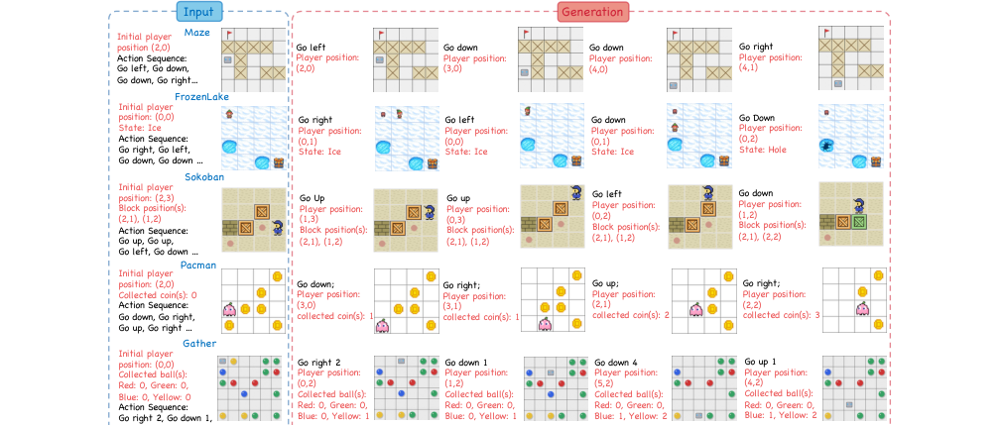
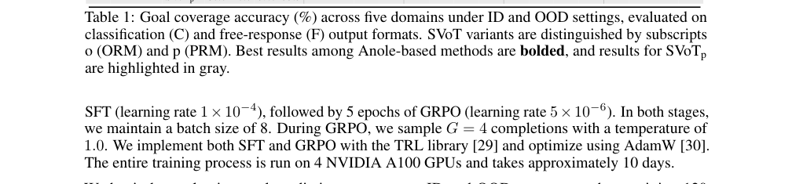
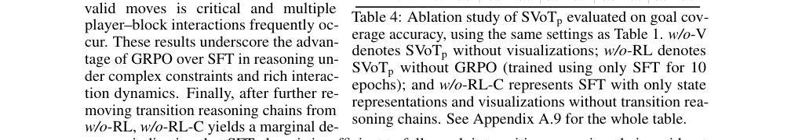

# RL让MLLM学会空间推理，SVoT准确率飙升65%
### 墨尔本大学新框架，用可视化+状态验证破解多跳空间推理难题

> 多模态大模型（MLLM）在空间推理任务上经常“翻车”：它们能描述一张图中物体的位置，但一旦需要跟踪多个步骤的状态变化（比如走迷宫、推箱子），推理链条就容易断裂。墨尔本大学团队提出的SVoT框架，通过强化学习让模型学会生成可验证的中间状态和可视化推理链，在分布外测试集上最高取得65%的绝对准确率提升。
**论文**：SVoT: State-aware Visualization-of-Thought for Spatial Reasoning via Reinforcement Learning
**作者**：Chao Lei, Yanbei Jiang, Markus Hiller, Zhijian Zhou, Xunye Tian 等
**来源**：[arXiv:2606.11770](https://arxiv.org/abs/2606.11770)

---
## 背景：多跳空间推理难在哪？
空间推理是规划、导航和机器人等任务的核心能力。对MLLM而言，真正的挑战在于**多跳推理**——模型需要根据一系列动作，准确预测每一步后的状态（如玩家的位置、收集的物品数量）。

当前方法存在两个痛点：一是大部分评测将状态更新简化为单一变量（如只问“最终是否成功”），忽略了多目标交互的复杂性；二是缺乏对中间状态的验证——即使模型蒙对了最终结果，也无法判断它是否真正理解了每一步的因果逻辑。

现有的可视化思维链（VoT）和其多模态升级版MVoT虽然试图通过生成文本或图像来跟踪状态，但它们的推理过程仍然是隐式的。
## 核心方法：SVoT做了什么？
SVoT（State-aware Visualization-of-Thought）的核心思路是：**让模型在每一步都显式地写出当前状态，并生成对应的可视化图像**，然后用强化学习（GRPO）来训练模型生成这些可验证的中间结果。

具体来说，SVoT在推理链中插入两部分内容：
1. **文本状态描述**：例如“玩家位置：(2,1)；收集硬币：2枚”
2. **状态可视化图像**：即当前网格世界的截图

模型需要先验证上一步动作的前提条件是否满足（如“前方是否有障碍”），再将动作效果更新到状态中，最后输出新的状态和可视化。

为了训练这种能力，团队设计了两种精细化的奖励函数：
- **结构奖励**（rv_str）：检查生成图像中物体（如玩家、箱子、墙壁）的类别和位置是否正确
- **质量奖励**（rv_qua）：评估生成图像的视觉质量（前景清晰度、背景一致性）

训练框架采用GRPO，每个问题采样多个推理链，然后用奖励信号指导模型向正确的推理模式优化。

*图1：SVoT使用的五个测试域，包括经典环境（Maze、FrozenLake、Sokoban）和新引入的Pacman与Gather域，后两者需要多目标交互和数值推理。*
## 实验结果有多强？
团队在五个域（Maze、FrozenLake、Sokoban、Pacman、Gather）上进行了评测，包括分布内（ID）和分布外（OOD）测试。OOD测试中，规划网格尺寸和物体数量都有变化。

**关键结果**：
- **SVoT整体性能**：在五个域的平均目标覆盖准确率上，SVoT以73.3%的成绩领先于MVoT（52.0%）和直接CoT（38.0%）
- **OOD提升高达65%**：在某些OOD测试集上，SVoT相比MVoT取得了最高65%的绝对准确率提升
- **组件消融**：移除文本状态描述后，准确率平均下降8%；移除可视化后下降12%；移除奖励中的结构或质量组件也会导致性能滑坡

值得注意的是，在Gather域（需要同时追踪4种颜色球的收集数量）中，SVoT的优势尤为突出，这说明框架对多目标数值推理场景的适配能力很强。

*表1：五个域在ID和OOD设置下的目标覆盖准确率（%），SVoT全面领先。*
## 实验分析：中间状态验证有多重要？
团队还专门测试了模型在“单步预测”上的表现——即给定前几步状态，预测下一步的精确状态。这直接衡量了模型对状态变化的跟踪能力。

结果说明：
- SVoT在单步预测上的准确率远高于MVoT，尤其是在需要多个物体交互的Sokoban和Pacman域
- 通过可视化生成质量的自动评估（前景-背景正确率），SVoT生成的图像在物体类别和位置匹配度上也显著更好

另外，参数研究显示：
- 可视化奖励中的结构组件（rv_str）比质量组件（rv_qua）更重要，但两者互补效果最好
- 奖励中的权重设置对结果敏感，团队建议采纳λh=0.4, λe=0.3, λc=0.3的组合

*表4：SVoTp（带过程奖励模型）的消融实验，展示了移除不同组件后的性能影响。*
## 写在最后
SVoT用强化学习巧妙地将“可视化推理”和“状态验证”结合在一起，让MLLM在空间推理任务上实现了质的飞跃。更关键的是，这个方法不依赖于人工标注的中间步骤，而是通过奖励函数自动引导模型学习如何生成可验证的推理链。如果你正在研究多模态推理、规划或可解释AI，SVoT的代码和评测基准值得深入看看。论文已在arXiv公开（2606.11770）。
---
📄 **阅读原文**：[PDF 下载](https://arxiv.org/pdf/2606.11770) | [arXiv 页面](https://arxiv.org/abs/2606.11770)

