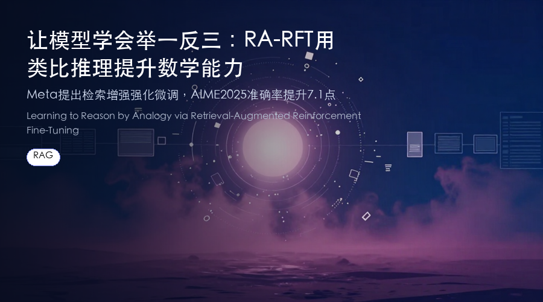

# 让模型学会“举一反三”：RA-RFT 用类比推理提升数学能力
### Meta 提出检索增强强化微调，AIME 2025 准确率提升 7.1 点

> 传统 RAG 检索只认表面相似，但数学题往往“形似神不似”。Meta 和莱斯大学的新工作提出 RA-RFT，让模型学会按推理结构找类比题，再通过强化学习微调，在 AIME 等竞赛级基准上显著超越 GRPO。
**论文**：Learning to Reason by Analogy via Retrieval-Augmented Reinforcement Fine-Tuning
**作者**：Zilin Xiao, Qi Ma, Chun-cheng Jason Chen, Xintao Chen, Avinash Atreya 等
**来源**：[arXiv:2606.13680](https://arxiv.org/abs/2606.13680)

---
## 为什么需要“推理感知”的检索？
检索增强生成（RAG）已成为大模型接入外部知识的标配手段，但在复杂推理任务上，传统基于词汇或语义相似度的检索常常失灵。

一个典型的例子：题目“已知 x + 1/x = 5，求 x³ + 1/x³”与“已知 x = 5，求 (x + 1/x)³”在语义上高度相似，但前者需要二项式展开技巧，后者只需直接代入。如果检索到前者，模型反而会被误导。

**简单来说**：语义相似 ≠ 推理有用。真正有效的类比，是那些解题思路（推理轨迹）可迁移的题目，而非表面看起来像的题目。
## 核心方法：RA-RFT 三步走
RA-RFT（Retrieval-Augmented Reinforcement Fine-Tuning）是一个后训练框架，包含三个阶段：

1. **黄金相关性蒸馏**：用一个裁判模型（Judge Model）直接评估候选题目与目标题目的推理轨迹是否可迁移，生成“推理有用性”标签，而非语义相似度标签。

2. **推理感知检索器训练**：利用上一步的标签，通过对比学习训练一个稠密检索器，使其能找出结构上类比的问题——即使表面看起来完全不同。

3. **强化微调**：将检索到的类比推理轨迹注入训练提示中，再用可验证结果奖励（RLVR）对策略模型进行强化微调，让模型学会在推理时参考外部类比。

**划重点**：RA-RFT 不修改奖励函数或优化器，而是通过提供更优质的上下文来提升强化学习 rollout 的质量，从而获得更有效的策略更新。
## 实验结果有多强？
在 AIME 2024/2025、HMMT 2025、BrUMO 2025 四个竞赛级数学推理基准上，RA-RFT 一致优于标准强化微调方法：

- **AIME 2025 average@32**：在 Qwen3-1.7B 上比 GRPO 提升 **7.1 点**，在 Qwen3-4B 上提升 **2.8 点**
- **四个基准平均**：Qwen3-1.7B 提升 **4.1 点**，Qwen3-4B 提升 **2.6 点**

这些结果表明，推理感知的检索是独立于奖励设计或训练课程的一个正交改进方向——即使不改变优化器，仅靠更好的上下文就能带来显著收益。
## 划重点：为什么这项工作值得关注？
- **问题定义清晰**：指出了传统 RAG 在推理任务上的根本矛盾——语义检索与推理有用性脱节。
- **方法简洁有效**：通过蒸馏+对比学习训练一个“推理感知”检索器，不改变强化学习框架本身，即插即用。
- **实验结果扎实**：在多个高难度竞赛基准上取得一致提升，且小模型（1.7B）提升幅度更大，说明该方法对资源受限场景尤其有价值。
- **可扩展性强**：作者指出，推理感知检索与奖励设计、训练课程等改进方向正交，未来可叠加使用。
## 写在最后
RA-RFT 为“检索+推理”提供了一个新范式：不是让模型记住更多题，而是教会它如何找到对的题来参考。对于数学、编程等需要结构化推理的任务，这种方法可能比单纯增大模型或数据量更高效。

论文和代码已公开，感兴趣的朋友可以到 arXiv 搜索「RA-RFT」查看原文。
---
📄 **阅读原文**：[PDF 下载](https://arxiv.org/pdf/2606.13680) | [arXiv 页面](https://arxiv.org/abs/2606.13680)

