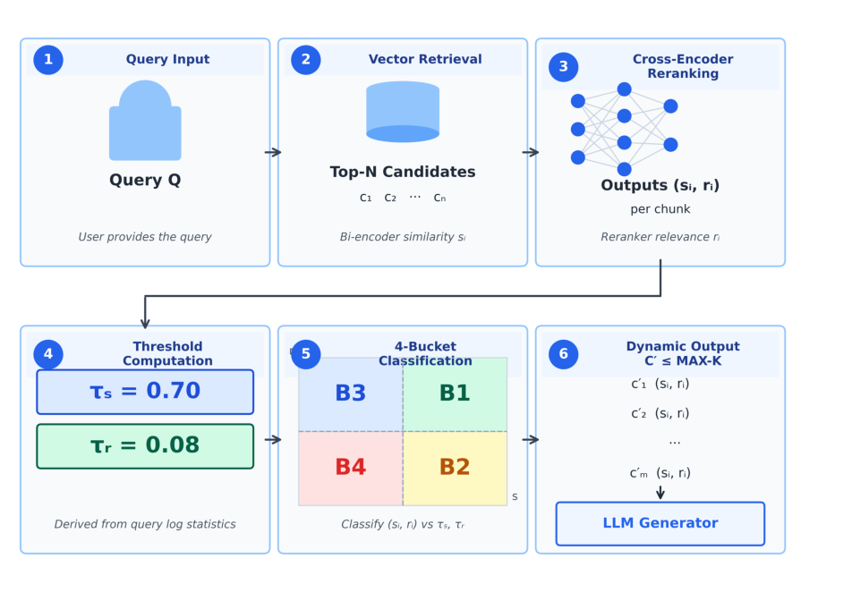
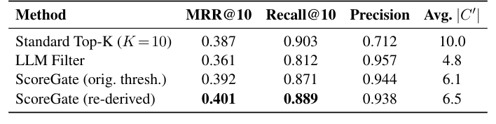

# RAG 每次固定取 K 个片段？ScoreGate 动态选择，省 35% 还更准
### 无需额外模型调用，双分数融合实现自适应检索数量

> 当前的 RAG 系统通常固定取 Top-K 个片段送入生成器，但简单查询只需 1 个片段，复杂查询可能需要 8 个以上。固定 K 值要么浪费 token，要么遗漏关键信息。ScoreGate 提出一种轻量级方法，利用检索和重排阶段已有的两个分数，动态决定保留多少片段，无需额外模型推理。
**论文**：ScoreGate: Adaptive Chunk Selection for Retrieval-Augmented Generation via Dual-Score Statistical Fusion
**作者**：Karamvir Singh, Arvind Jain
**来源**：[arXiv:2606.14269](https://arxiv.org/abs/2606.14269)

---
## 固定 K 值的问题：简单查询喂太多，复杂查询不够用
在标准 RAG 流水线中，bi-encoder 先检索出 Top-N 候选，cross-encoder 重排后取固定的 Top-K 个片段送入生成器。K 是部署前设定的超参数，对所有查询一视同仁。

但查询复杂度差异巨大：像“退款政策是什么？”这样的导航式查询，一个片段就能回答；而“比较 A 和 B 方案在价格、功能、取消条款上的差异”这类组合式查询，可能需要 8 个或更多片段。

设置较小的 K 会导致覆盖不足，设置较大的 K 则会注入低相关度的干扰片段，增加生成错误率和 token 成本。无论 K 取大取小，都无法解决这个矛盾，因为最优片段数量取决于查询本身，而不是一个常数。
## 核心方法：ScoreGate 如何用双分数做自适应选择？
ScoreGate 的核心洞察是：bi-encoder 的相似度分数 s_i 和 cross-encoder 的重排分数 r_i 联合起来携带了比单一分数更丰富的信号。

具体来说，bi-encoder 会因词汇不匹配（如同义改写、领域特定同义词）而低估某些语义相关的片段，但 cross-encoder 通过完整的 query-document 注意力机制，往往能正确识别这些片段的相关性。单一分数阈值无法可靠地找回这些片段，而 (s_i, r_i) 联合分数对则能识别并“拯救”它们。

ScoreGate 将 (s_i, r_i) 分数空间划分为四个区域，对一致性区域采用确定性规则，对不一致区域采用基于阈值的融合策略。整个过程不需要额外的模型推理调用，仅利用标准流水线中已有的两个分数。此外，系统还设有一个 MAX-K 上限，防止上下文窗口溢出。

*图1：ScoreGate 流水线。用户查询触发 bi-encoder 向量检索 Top-N 候选，cross-encoder 重排后，ScoreGate 基于双分数自适应选择片段送入生成器。*
## 实验结果有多强？零误报、34.8% token 减少、仅增 31ms 延迟
ScoreGate 在 MS MARCO（200 条开发查询）上达到 MRR@10 = 0.401，同时比标准 Top-K 少保留 35% 的片段。

在内部基准测试（n=300，Fleiss' κ=0.87）上，ScoreGate 在 97.77-99.34% 召回率下实现了零误报（95% CI [96.4%, 100%]），每个查询减少 34.8% 的 token，端到端延迟仅增加 31 毫秒。

与 LLM 过滤方法（使用 GPT-4o-mini 逐片段判断）相比，ScoreGate 在召回率上显著领先（97.77-99.34% vs. 91.11-92.41%），且无需额外的大模型推理调用。幻觉率也从 8.33% 降至 2.33%。

*表2：MS MARCO 段落排名结果（200 条开发查询）。ScoreGate 在 MRR@10 上达到 0.401，同时保留的片段数减少 35%。*
## 划重点：ScoreGate 的实用价值与部署优势
- **零额外模型推理**：仅利用 bi-encoder 和 cross-encoder 已有的分数，无需训练新模型或增加推理调用。
- **显著降低 token 成本**：每个查询减少约 35% 的 token，对大规模生产系统能节省可观的计算和成本。
- **保持或提升检索质量**：在减少片段数量的同时，召回率和 MRR 均优于固定 K 值方法。
- **即插即用**：可无缝接入现有两阶段 RAG 流水线，无需架构改动。
- **生产安全**：MAX-K 上限防止上下文窗口溢出，兼容下游固定上下文组件。

ScoreGate 在 MS MARCO 和真实生产流量上的结果均表明，自适应检索数量可以在不降低检索质量的前提下提升检索效率。
## 写在最后
ScoreGate 用简单的双分数融合策略，解决了 RAG 系统中长期存在的固定 K 值困境。如果你正在搭建或优化 RAG 系统，不妨看看这篇论文的具体实现细节。论文已公开在 arXiv（2606.14269），代码和内部基准数据也已开源。
---
📄 **阅读原文**：[PDF 下载](https://arxiv.org/pdf/2606.14269) | [arXiv 页面](https://arxiv.org/abs/2606.14269)

