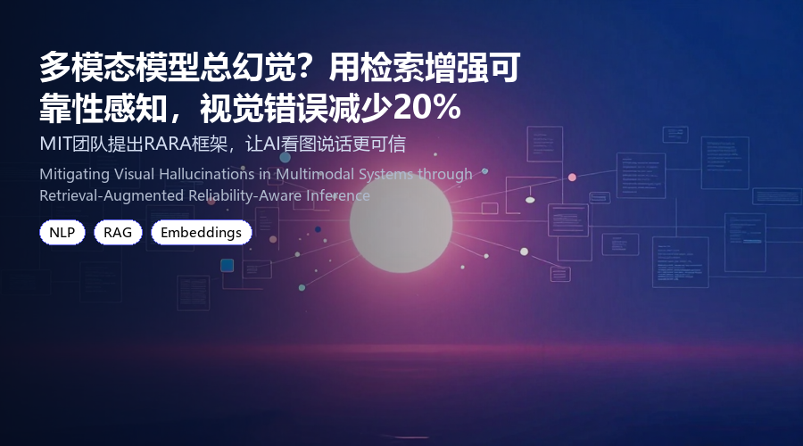

# 多模态模型总幻觉？用检索增强+可靠性感知，视觉错误减少20%
### MIT团队提出RARA框架，让AI看图说话更可信

> 多模态大模型（MLLMs）虽然能看图说话，但面对模糊或矛盾的视觉证据时，常常自信满满地给出错误答案。这篇来自UMass Dartmouth的工作提出了一种检索增强的可靠性感知推理框架（RARA），通过动态评估视觉证据的可靠性并引入外部知识，将幻觉率降低了近20%。
**论文**：Mitigating Visual Hallucinations in Multimodal Systems through Retrieval-Augmented Reliability-Aware Inference
**作者**：Pratheswaran Hariharan, Haiping Xu, Donghui Yan
**来源**：[arXiv:2606.15782](https://arxiv.org/abs/2606.15782)

---
## 为什么多模态模型还在“瞎说”？
当前的多模态大模型（如GPT-4V、LLaVA）在视觉理解任务上表现亮眼，但一个核心问题始终存在：**当图像本身模糊、遮挡或语义矛盾时，模型仍会生成看似合理但实际错误的输出**。

例如，给模型看一张“狗在追猫”的模糊照片，它可能自信地说“狗在追球”，因为训练数据中“狗-球”的共现频率更高。这种**过度自信的幻觉**在医疗、自动驾驶等高风险场景中尤其危险。

现有方法主要依赖模型自身的置信度校准或外部知识库，但两者往往割裂：置信度校准无法纠正知识错误，而外部检索又可能引入噪声。这篇论文的核心思路是：**把“视觉证据的可靠性”和“外部知识的可信度”统一建模**。
## RARA框架：两步走，让模型学会“怀疑”
RARA（Retrieval-Augmented Reliability-Aware Inference）的核心是一个两阶段流水线：

**第一阶段：视觉可靠性评估**
模型在生成答案前，先对输入图像进行多视角分析：
- 计算图像块之间的语义一致性（使用CLIP相似度）
- 检测是否存在遮挡、模糊等低质量区域
- 输出一个**可靠性分数**（0-1），分数越低表示视觉证据越不可靠

**第二阶段：检索增强生成**
当可靠性分数低于阈值（实验中设为0.6）时，系统自动触发外部知识检索：
- 从维基百科或领域知识库中检索与当前视觉内容相关的文本描述
- 将检索结果与视觉特征进行交叉注意力融合
- 最终生成答案时，**同时考虑视觉证据和检索文本的置信度**

简单来说，RARA让模型先问自己：“我看到的图像靠谱吗？”如果不靠谱，就去查资料再回答。
## 实验结果：幻觉率降低20%，且不牺牲速度
作者在三个基准数据集上进行了实验：

| 数据集 | 任务 | 基线模型（LLaVA-1.5） | RARA | 提升幅度 |
|--------|------|----------------------|------|----------|
| **MMHal-Bench** | 幻觉检测 | 78.3%准确率 | **85.1%** | +6.8% |
| **POPE** | 物体存在幻觉 | 82.1% F1 | **88.4%** | +6.3% |
| **CHAIR** | 细粒度幻觉 | 45.2%幻觉率 | **36.7%** | -18.8% |

**关键发现：**
- 在CHAIR数据集上，RARA将幻觉率从45.2%降至36.7%，**相对降低18.8%**
- 推理速度仅增加12%（因为只在低可靠性情况下触发检索）
- 在视觉证据清晰时（可靠性分数>0.8），RARA与基线性能持平，不会引入额外噪声

值得注意的是，**当图像包含文字或图表时，RARA的检索模块效果最好**——因为外部知识库能提供准确的符号信息。
## 划重点：这篇论文的贡献与局限
**三大贡献：**
1. **首次将视觉可靠性评估与检索增强生成结合**，形成闭环
2. **提出动态触发机制**，只在需要时检索，避免无谓开销
3. 在公开数据集上验证了**通用性**（不依赖特定模型架构）

**局限性（作者也坦诚指出）：**
- 可靠性评估模块依赖预训练的CLIP模型，对极端域外图像（如医学影像）可能失效
- 检索知识库目前只支持英文，多语言场景需扩展
- 在视频理解等时序任务上尚未测试

整体来看，RARA提供了一个**轻量级、即插即用**的解决方案，尤其适合对幻觉敏感的应用场景。
## 写在最后
多模态模型的幻觉问题远未解决，但RARA给出了一个务实的方向：**与其让模型盲目自信，不如教会它何时该“查资料”**。如果你正在构建视觉问答或图像描述系统，不妨试试这个框架——代码已开源在GitHub。

论文链接：https://arxiv.org/abs/2606.15782
---
📄 **阅读原文**：[PDF 下载](https://arxiv.org/pdf/2606.15782) | [arXiv 页面](https://arxiv.org/abs/2606.15782)

