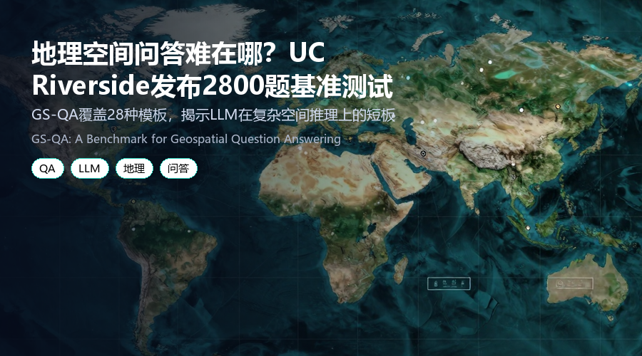

# 地理空间问答难在哪？UC Riverside 发布 2800 题基准测试
### GS-QA 覆盖 28 种模板，揭示 LLM 在复杂空间推理上的短板

> 当大语言模型遇上地理空间问题，效果到底如何？UC Riverside 团队构建了 GS-QA 基准，包含 2800 个问答对，覆盖方向过滤、多源推理等复杂场景。测试发现，现有模型在简单问题上表现不错，但面对复杂空间谓词和数值输出时，准确率大幅下降。
**论文**：GS-QA: A Benchmark for Geospatial Question Answering
**作者**：Majid Saeedan, Muhammad Shihab Rashid, Ahmed Eldawy, Vagelis Hristidis
**来源**：[arXiv:2605.22811](https://arxiv.org/abs/2605.22811)

---
## 为什么要关注这篇论文？
地理空间问答（GeoQA）的目标是让用户用自然语言查询空间数据，例如“UCR 附近 50 公里内、朝向 LAX 方向的四星级酒店有哪些？”这类问题需要同时理解空间谓词（如“朝向”）、多源数据（如 OpenStreetMap 和 Wikipedia）以及数值计算。

现有的 GeoQA 基准存在规模小、空间谓词有限、输出类型单一等问题。GS-QA 填补了这一空白，提供了 2800 个问答对，覆盖 28 种模板，并引入方向过滤、多源推理等新挑战。
## GS-QA：一个可扩展的地理空间问答基准
GS-QA 基于 OpenStreetMap 和 Wikipedia 数据构建，包含 28 个问题模板，覆盖多种空间对象（点、线、面）、空间谓词（包含、距离、方向、朝向过滤）和输出类型（实体名称、位置、距离、方向、计数、聚合面积/长度）。

一个关键特点是部分问题需要结合多源信息，例如从 OSM 获取空间数据，从 Wikipedia 获取事实信息。基准还提供了全面的评估方法，结合文本问答指标和地理空间专用指标（如距离误差、角度误差）。

下图展示了一个典型的地理空间问答示例：

*图1：地理空间问答示例——寻找 UCR 附近 50 公里内、朝向 LAX 方向的四星级酒店*
## 实验结果：简单问题尚可，复杂场景大幅下滑
研究团队测试了 9 种基线方法，使用 GPT-4o、Claude Sonnet 4.6 和 Ministral-3 三种 LLM，结合直接提示、检索增强生成（RAG）和 Text-to-SQL 策略。

**主要发现：**
- 在简单空间谓词和实体名称输出上，现有方法表现合理，F1 分数可达 0.8 以上。
- 对于复杂空间谓词（如方向过滤）和数值输出（如距离、面积），准确率显著下降，部分模板的 F1 分数低于 0.3。
- 多源推理任务尤其困难，模型常忽略方向谓词或返回不准确的位置。

下表对比了 GS-QA 与现有 GeoQA 基准在数据来源、问题规模、空间概念和输出类型上的差异：

*表1：GS-QA 与现有 GeoQA 基准对比*
## 划重点：地理空间问答仍是开放挑战
GS-QA 的测试结果揭示了当前 LLM 在地理空间推理上的三大短板：
1. **空间谓词理解不足**：模型常忽略方向过滤等复杂谓词，返回不相关结果。
2. **数值输出精度低**：对于距离、面积等数值型答案，相对误差较大。
3. **多源推理困难**：结合空间和事实信息的问答，准确率明显低于单源任务。

研究团队已公开 GS-QA 基准和评估代码，鼓励社区在此基础上开发更强大的地理空间问答系统。
## 写在最后
GS-QA 为地理空间问答研究提供了一个系统化的评估平台。如果你正在开发或评估 LLM 在空间数据上的应用，这个基准值得一试。论文和代码已公开，欢迎前往 arXiv 查看原文（arXiv: 2605.22811）。
---
📄 **阅读原文**：[PDF 下载](https://arxiv.org/pdf/2605.22811) | [arXiv 页面](https://arxiv.org/abs/2605.22811)

