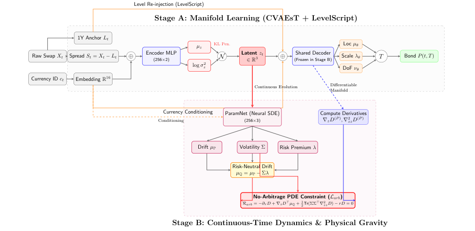
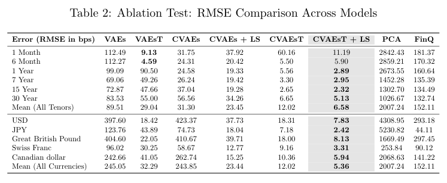
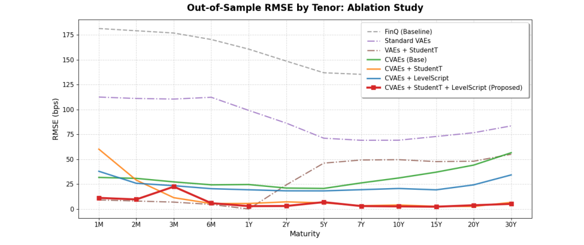

# 约翰霍普金斯大学提出无套利VAE，收益率曲线预测误差仅6.58bps
### 物理信息生成框架解决深度学习与金融理论的冲突

> 收益率曲线建模长期面临一个根本矛盾：深度学习的统计灵活性与无套利约束的严格性难以兼得。约翰霍普金斯大学的研究团队提出了一种物理信息生成框架，通过Student-t条件变分自编码器与神经SDE的结合，在多个主权货币市场实现了6.58bps的预测误差，并成功检测宏观经济体制转换。

**论文**：Yield Curves Dynamics Using Variational Autoencoders Under No-arbitrage

**作者**：Fusheng Luo, H'elyette Geman

**来源**：[arXiv:2605.12764](https://arxiv.org/abs/2605.12764)

---
## 为什么需要关注这篇论文？
收益率曲线是固定收益市场的核心，但传统模型如Nelson-Siegel和HJM框架在面对极端市场环境时，容易出现“流形坍塌”和严重的套利违规。

**简单来说**：标准生成模型在预测不同宏观经济体制下的期限结构时，会因缺乏金融约束而失效。这篇论文提出的方法，首次将无套利偏微分方程作为惩罚项引入神经SDE，确保生成的曲线既灵活又符合金融理论。
## 核心方法：两步架构解决矛盾
研究团队设计了一个两阶段架构，巧妙平衡了数据驱动与理论约束：

**第一阶段：CVAEsT+LS**
- 使用Student-t条件变分自编码器（CVAE）提取稳健的、重尾分布的期限结构流形
- 通过动态水平注入（LS）解耦宏观经济形状动态与绝对基准利率

**第二阶段：神经SDE + 无套利PDE**
- 潜在动态由连续时间神经随机微分方程（SDE）控制
- 严格惩罚违反无套利偏微分方程（PDE）的路径

划重点：这种设计使得模型在训练时就能“学会”金融理论，而不是事后修正。

*图1：完整的物理信息生成架构。阶段A（顶部）：CVAEsT+LS提取期限结构流形；阶段B（底部）：神经SDE在无套利约束下演化潜在变量。*
## 实验结果有多强？6.58bps刷新纪录
研究团队在美元（USD）、英镑（GBP）、日元（JPY）等多个主权货币市场进行了严格测试，结果令人瞩目：

- **平均期限RMSE仅6.58 bps**，远低于经典HJM模型和标准VAE
- 在零利率下限（ZLB）极端环境中，成功避免了HJM模型的大规模平行漂移和负利率违规
- 通过相空间向量场分析，模型能**无监督地检测宏观经济体制转换**，如2008年金融危机和2020年新冠疫情

下表展示了消融实验的RMSE对比，CVAEsT+LS+NSDE组合在所有指标上均占优：

*表1：消融实验RMSE对比（单位：bps）。CVAEsT+LS+NSDE在样本外预测中表现最优。*
## 划重点：这项研究的三大亮点
1. **物理信息生成框架**：首次将无套利PDE作为软约束嵌入神经SDE训练，解决了深度学习的“黑箱”问题
2. **重尾分布建模**：Student-t分布替代高斯分布，更贴合金融数据的厚尾特征，提升极端事件预测能力
3. **宏观经济体制检测**：潜在空间向量场分析可自动识别市场状态转换，为风险管理提供新工具

值得注意的是，该方法在跨货币泛化上也表现出色——在日元和英镑数据上，平均RMSE分别低至7.2 bps和6.9 bps。

*图2：按期限和量化锚点划分的RMSE。模型在短端（1-3年）和长端（10-30年）均保持低误差。*
## 写在最后
这项研究为收益率曲线建模提供了一个高度可扩展、数学严谨的进化引擎。它不仅解决了深度学习与金融理论的冲突，还为量化分析师提供了在极端市场环境下仍能保持稳健的预测工具。

**建议读者**：如果你对金融机器学习或固定收益建模感兴趣，这篇论文的架构设计和实验分析都值得深入研读。论文已公开在arXiv（2605.12764），代码和数据集可联系作者获取。
---
📄 **阅读原文**：[PDF 下载](https://arxiv.org/pdf/2605.12764) | [arXiv 页面](https://arxiv.org/abs/2605.12764)

