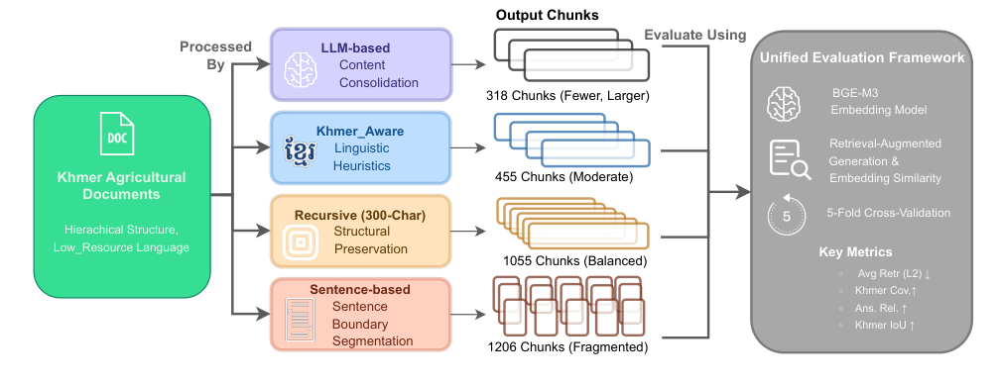
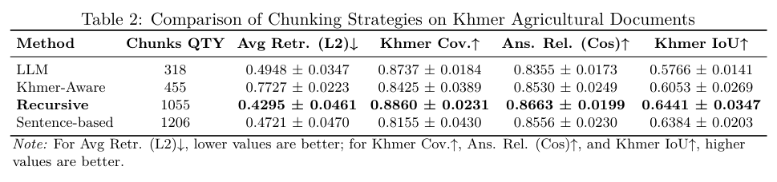

# 低资源语言RAG怎么切块？四种策略对比，递归法胜出
### 高棉语农业文档实验：字符级递归分块效果最佳

> 在RAG系统中，文档分块（Chunking）是影响检索质量的关键一步。但对于高棉语这类无词边界、形态复杂的低资源语言，哪种分块策略最有效？这篇来自忠北国立大学的研究，系统对比了四种方法，给出了明确答案。

**论文**：Evaluation of Chunking Strategies for Effective Text Embedding in Low-Resource Language on Agricultural Documents

**作者**：Sovandara Chhoun, Pichdara Po, Sereiwathna Ros, Wan-Sup Cho, Saksonita Khoeurn

**来源**：[arXiv:2605.22203](https://arxiv.org/abs/2605.22203)

---
## 为什么要关注这篇论文？
RAG（检索增强生成）已经成为大模型落地的重要范式，但大多数研究集中在高资源语言（如英语）上。对于高棉语（柬埔寨官方语言）这类**无词边界、标点不规则、NLP资源稀缺**的语言，传统分块方法往往失效。

农业文档包含大量多步骤操作流程和专业术语，对语义连续性要求极高。**分块太粗，语义模糊；分块太细，上下文断裂**。这篇论文正是针对这一痛点，系统评估了四种分块策略在低资源语言RAG中的表现。
## 核心方法：四种分块策略 + 统一评估流程
研究采用了**端到端的分块评估流程**（图1），具体步骤为：文档分块 → BGE-M3多语言嵌入模型编码 → FAISS向量检索 → 基于18个问答对的5折交叉验证评估。

四种分块策略分别是：
- **Recursive（递归分块）**：基于字符数固定切分，带重叠窗口
- **Khmer-Aware（高棉语感知分块）**：利用高棉语分词工具进行语言感知切分
- **Sentence-Based（基于句子分块）**：按句子边界切分
- **LLM-Based（大模型分块）**：使用大模型进行语义分块

评估指标包括：平均检索分数（L2距离）、答案相关性（余弦相似度）、高棉语覆盖率（Khmer Coverage）和高棉语交并比（Khmer IoU）。

*图1：端到端分块评估流程*
## 实验结果有多强？递归法全面领先
实验结果显示，**字符级递归分块（chunk size=300字符）** 在所有指标上表现最优：
- **最低L2距离**：0.4295 ± 0.0461（检索最准确）
- **最高答案相关性**：0.8663 ± 0.0199
- **最高高棉语IoU**：0.6441 ± 0.0347

配对t检验表明，递归法在L2距离上**显著优于**基于句子分块（p=0.0121）。

表2展示了四种策略的完整对比数据，递归法在检索精度和语义保持上均占优势。值得注意的是，LLM-Based分块虽然语义理解能力强，但计算成本高且在高棉语上并未超越简单的字符级递归法。

*表2：四种分块策略在高棉语农业文档上的性能对比*
## 划重点：给低资源语言RAG的启示
1. **分块粒度比花哨方法更重要**：对于形态复杂的低资源语言，简单的字符级递归分块（300字符）反而比语言感知或大模型分块更有效。
2. **语义连续性优先**：固定窗口+重叠策略能更好地保留多步骤农业文档的上下文关联。
3. **计算效率优势**：递归分块无需额外语言工具或大模型推理，部署成本低。
4. **统计显著性验证**：研究采用5折交叉验证和配对t检验，结论可靠。
## 写在最后
这项研究为低资源语言RAG系统的分块策略选择提供了实证依据。对于高棉语、缅甸语、老挝语等类似语言，**优先尝试字符级递归分块**可能是更务实的选择。论文已公开在arXiv，感兴趣的读者可以查阅完整实验设置和代码。
---
📄 **阅读原文**：[PDF 下载](https://arxiv.org/pdf/2605.22203) | [arXiv 页面](https://arxiv.org/abs/2605.22203)

