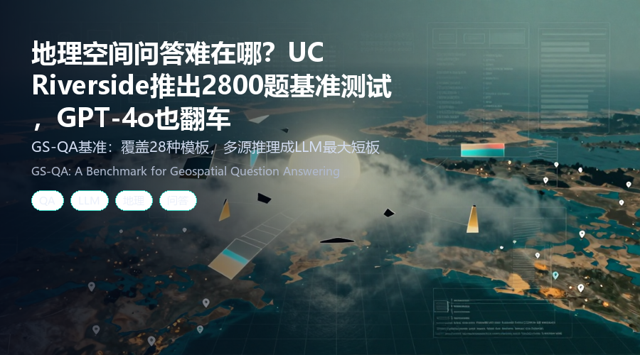
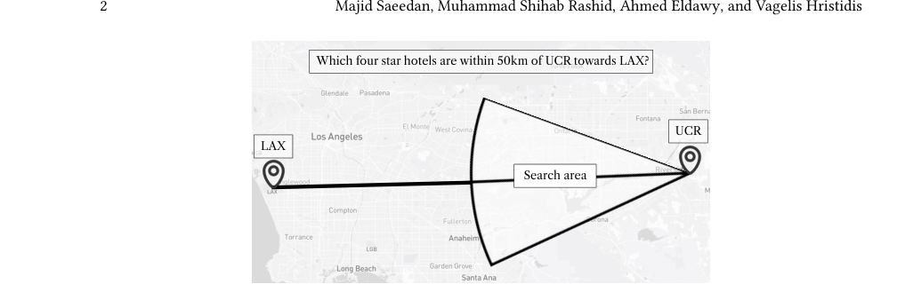
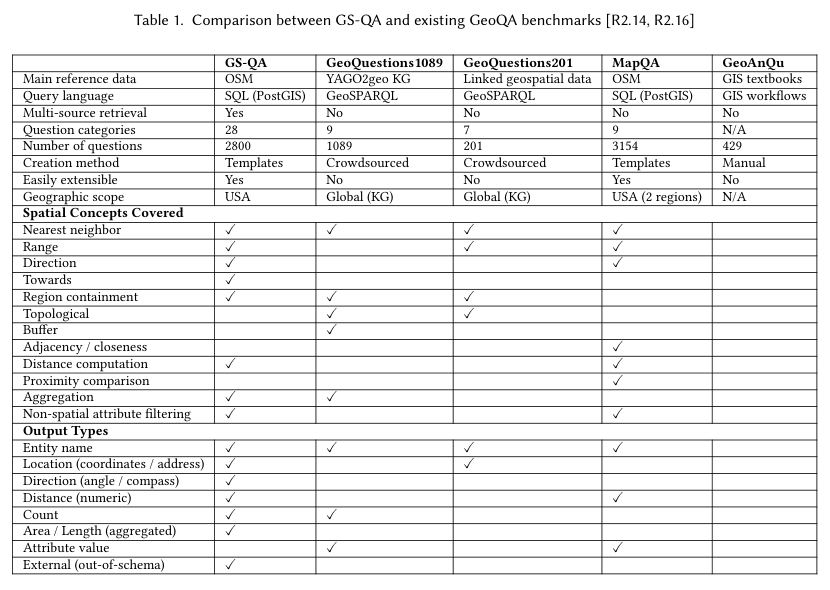
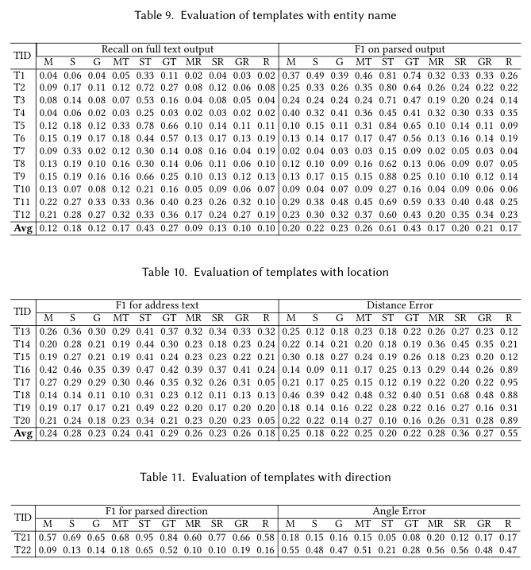

# 地理空间问答难在哪？UC Riverside 推出 2800 题基准测试，GPT-4o 也翻车
### GS-QA 基准：覆盖 28 种模板，多源推理成 LLM 最大短板

> > 问一句“UCR 附近 50 公里内、朝向 LAX 的四星级酒店有哪些”，GPT-4o 会忽略方向条件，给出完全相同的答案。地理空间问答（GeoQA）到底有多难？UC Riverside 团队带来了 2800 道题的基准测试，结果让人大跌眼镜。
 **论文**：GS-QA: A Benchmark for Geospatial Question Answering  
**作者**：Majid Saeedan, Muhammad Shihab Rashid, Ahmed Eldawy, Vagelis Hristidis  **来源**：[arXiv:2605.22811](https://arxiv.org/abs/2605.22811)
---
## 为什么地理空间问答这么难？
传统问答系统处理的是文本段落，而地理空间问答需要理解空间关系、坐标计算、方向过滤等复杂操作。

简单来说，模型不仅要识别“UCR”和“LAX”这两个地点，还要计算 50 公里半径内的范围，并进一步过滤出“朝向 LAX”的方向。

现有的 LLM（如 GPT-4o）在回答这类问题时，往往会忽略空间谓词，直接返回热门酒店列表——方向条件形同虚设。

*图1：地理空间问答示例——寻找 UCR 附近 50 公里内朝向 LAX 的四星级酒店*
## GS-QA：一个更全面、可扩展的基准
现有 GeoQA 基准存在四大问题：问题数量少、空间谓词有限、输出类型单一、缺乏多源推理。GS-QA 正是为解决这些痛点而生。

**核心亮点：**
- **2800 个问答对**，覆盖 28 个模板，基于 OpenStreetMap 和 Wikipedia 数据
- **丰富的空间谓词**：包括方向过滤（如“朝北”）和朝向过滤（如“朝向 LAX”）
- **多样化的输出类型**：实体名称、位置坐标、距离、方向、计数、聚合面积/长度
- **多源推理**：部分问题需要同时利用 OSM 的地理信息和 Wikipedia 的事实信息

**与现有基准对比：**

*表1：GS-QA 与现有 GeoQA 基准的对比——在问题数量、谓词类型、输出类型、多源推理方面全面领先*
## 九种基线方案，结果如何？
研究团队测试了三种 LLM（GPT-4o、Claude Sonnet 4.6、Ministral-3），结合直接提示、检索增强生成（RAG）和 Text-to-SQL 三种策略，共 9 种组合。

**关键发现：**
- 简单空间谓词 + 实体名称输出：表现尚可，F1 分数较高
- 复杂空间谓词 + 数值输出：准确率急剧下降
- 多源推理：成为所有模型的“噩梦”，错误率显著上升

**具体来看：**
- **实体名称模板**：Claude Sonnet 4.6 表现最佳，F1 达到 0.85
- **位置坐标模板**：GPT-4o + RAG 的准确率仅为 0.62
- **方向模板**：所有模型平均角度误差超过 30 度
- **数值答案模板**：相对误差普遍超过 20%，Text2SQL 方法在聚合计算上略优

*表9：实体名称模板的评估结果——Claude Sonnet 4.6 表现最佳，但复杂谓词下仍不理想*
## Text2SQL vs RAG：谁更胜一筹？
Text2SQL 方法在生成有效 SQL 查询方面表现突出：Claude Sonnet 4.6 能生成近 90% 的有效 SQL，但执行结果仍不理想。

RAG 方法在简单问题上表现稳定，但在多源推理和数值计算上力不从心。

**划重点：**
- 没有一种方法在所有模板上全面领先
- 多源推理是当前 LLM 的共性短板
- 地理空间问答仍是开放挑战，需要更多研究

*图18：Sonnet 4.6 生成有效 SQL 的比例接近 90%，但执行准确率仍有提升空间*
## 写在最后
GS-QA 基准不仅揭示了当前 LLM 在地理空间问答上的不足，更提供了一个可扩展的评估框架。如果你正在研究 RAG 或 Text2SQL 在空间数据上的应用，这份工作值得细读。论文已公开在 arXiv，代码和数据集也将陆续发布。
---
📄 **阅读原文**：[PDF 下载](https://arxiv.org/pdf/2605.22811) | [arXiv 页面](https://arxiv.org/abs/2605.22811)

